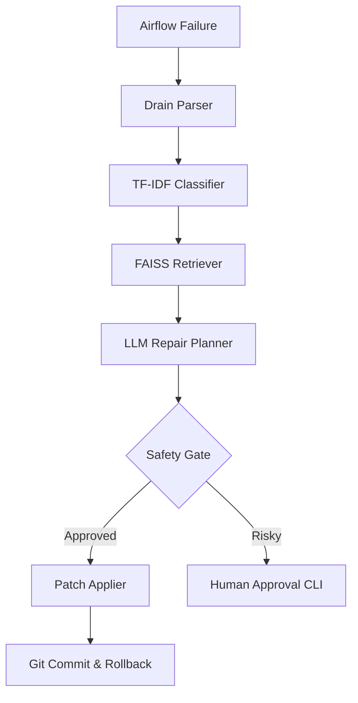

# 🧬 Self-Healing Workflow AI
**An Intelligent Autonomous Repair Pipeline for Apache Airflow**

Self-Healing Workflow AI is a multi-stage orchestration system designed to minimize downtime in data pipelines. It doesn't just monitor failures; it **diagnoses** them using machine learning, **retrieves** expert solutions from a knowledge base, and **executes** safe, audited patches to the infrastructure.

---

## 🏗️ Architecture Overview

The system operates across three distinct logic layers to take a failure from detection to resolution:



### 🧩 Core Components
1.  **Failure Intelligence (M1)**: Synthetic episode generation and regex-based initial labeling.
2.  **Drain Log Parser (M2)**: Advanced clustering algorithm that extracts stable event templates from noisy logs.
3.  **ML Classifier (M2)**: A TF-IDF + Logistic Regression model trained to identify 5 core failure classes with >99% accuracy.
4.  **Playbook RAG (M2)**: FAISS-powered semantic search that retrieves repair SOPs from a YAML knowledge base.
5.  **Repair Planner (M2)**: A constrained-output LLM (Groq/OpenAI) that generates validated JSON repair plans.
6.  **Patch Applier (M2)**: A safety-critical engine that modifies `.env` files and DAG configurations using regex-based patching.

---

## 🛠️ Setup & Installation

### 1. Requirements
- Python 3.10+
- Docker & Docker Compose (for Airflow)
- **Groq API Key** (Recommended) or OpenAI API Key

### 2. Installation
```bash
# Clone the repository
git clone https://github.com/your-repo/self-healing-ai.git
cd self-healing-ai

# Create and activate virtual environment
python -m venv venv
source venv/bin/activate

# Install dependencies
pip install -r requirements.txt
```

### 3. Configuration
Create a `.env` file in the root directory:
```env
# AI Backend
GROQ_API_KEY=your_groq_key_here
GROQ_MODEL=llama-3.3-70b-versatile

# Airflow Config
AIRFLOW_USER=airflow
AIRFLOW_PASSWORD=airflow
AIRFLOW_BASE_URL=http://localhost:8080
```

---

## 🚀 Usage Guide

### Phase 1: Episode Generation (M1)
Generate the synthetic failure dataset (60 episodes) used for training and testing.
```bash
# Generate raw failure logs
python -m episode_generator.generate_episodes --dry-run
```

### Phase 2: Log Parsing & Indexing (M2)
Clean the logs and prepare the Playbook retrieval index.
```bash
# Parse logs into templates
python -m log_parser.drain_parser --episodes data/episodes_raw.jsonl --out data/parsed_logs.jsonl

# Build the FAISS vector index for the Playbook
python -m playbook.retriever --build
```

### Phase 3: AI Repair Planning (M2)
Generate intelligent repair plans based on the classified failures.
```bash
# Enrich episodes with retrieved SOPs
python -m playbook.enrich_episodes

# Run the LLM Planner
python -m planner.repair_planner --plan-all --episodes data/episodes_enriched.jsonl --out data/repair_plans.jsonl
```

### Phase 4: Patch Application (M2)
Apply the generated fixes to the project configuration.
```bash
# Dry-run to verify safety
python -m patcher.patch_applier --apply-all data/repair_plans.jsonl --dry-run

# Execute real patches (requires Git initialized)
python -m patcher.patch_applier --apply-all data/repair_plans.jsonl
```

---

## 🛡️ Safety & Auditing

The **Patch Applier** includes multi-layered safety protocols:
- **Operation Whitelist**: Supports only `set_env`, `set_retry`, `set_timeout`, `replace_path`, and `add_precheck`.
- **Regex Guard**: Modifications use strict regex patterns to ensure only the target line is altered.
- **Audit Logging**: Every action is saved to `data/audit_log.jsonl` with timestamps and diffs.
- **Git Integration**: Every patch creates a unique Git commit (e.g., `feat(auto-repair): applied plan_ep_001`), allowing for instant 1-click rollbacks.

---

## 📊 Maintenance & Monitoring

To view the audit trail of all self-healing actions:
```bash
python -m patcher.patch_applier --audit
```

To re-evaluate the ML classifier accuracy:
```bash
python -m classifier.ml_classifier --train data/episodes_classified.jsonl
```

---

## 🤝 Project Credits
| Component | Expert Domain |
| :--- | :--- |
| **Log Clustering** | Drain Algorithm Implementation |
| **Failure Classification** | TF-IDF + Logistic Regression |
| **Knowledge Retrieval** | FAISS Vector RAG |
| **LLM Orchestration** | Constrained JSON Repair Planning |
| **Automated Patching** | Git-Integrated Regex Patching |

---
